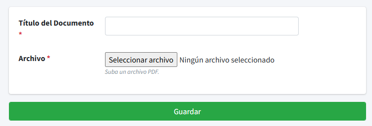

# CV Backend - Proyecto Django - Docs - Multimedia Manager

Explicación de la aplicación `Multimedia Manager` del proyecto CV Backend.

---

## Tabla de Contenidos

1. [Introducción](#introducción)
2. [descripción general](#descripción-general)
3. [Documentación del Modelo `MediaFile`](#documentación-del-modelo-mediafile)
4. [Imágen del administrador]

---

## Introducción

La idea de la aplicación `multimedia_manager` es tener un lugar centralizado para gestionar archivos multimedia que son utilizados por otras aplicaciones del proyecto. Además es necesario para poder introducir la funcionalidad del comprersor de imágenes.

---

## Descripción General

La aplicación de `multimedia_manager` consta de dos modelos `MediaFile` para poder gestionar imágenes. El otro modelo de `DocumentFile` es para gestionar documentos **importante: es el encargado de gestionar el fichero del cv de los usuarios**.

# Documentación del Modelo `MediaFile`

El modelo `MediaFile` representa un archivo multimedia, principalmente imágenes, con soporte para generar versiones redimensionadas adaptadas a diferentes dispositivos.

---

## Descripción General del Modelo `MediaFile`

- **Nombre del Modelo**: `MediaFile`
- **Propósito**: Gestionar archivos de imágenes y generar versiones optimizadas para PC, tabletas y móviles.

### Campos

| Campo                  | Tipo             | Descripción                                                                                  |
| ---------------------- | ---------------- | -------------------------------------------------------------------------------------------- |
| **`file`**             | `FileField`      | Archivo de imagen a cargar. Se guarda en la carpeta `media_files/`.                          |
| **`title`**            | `CharField`      | Título o descripción opcional para la imagen. Longitud máxima de 255 caracteres.             |
| **`uploaded_at`**      | `DateTimeField`  | Fecha y hora en que se subió el archivo. Se establece automáticamente al momento de subirlo. |
| **`image_for_pc`**     | `ImageSpecField` | Versión redimensionada de la imagen para pantallas de PC (1920x1080). Formato: JPEG.         |
| **`image_for_tablet`** | `ImageSpecField` | Versión redimensionada de la imagen para tabletas (1024x768). Formato: JPEG.                 |
| **`image_for_mobile`** | `ImageSpecField` | Versión redimensionada de la imagen para móviles (640x480). Formato: JPEG.                   |

### Meta

Este modelo hereda de `BaseModel`, lo que proporciona los campos y funcionalidades comunes para la trazabilidad de creación y modificación.

### Métodos y Sobrescrituras

#### **`save(self, \*args, **kwargs)`\*\*

- Sobrescribe el método `save` para:
  - Establecer el usuario que creó o modificó el registro.
  - Actualizar las fechas de creación y modificación.

#### **`_get_current_user(self)`**

- Obtiene el usuario actualmente autenticado.
- Retorna `None` si no hay un usuario autenticado.
- **Se esta valorando eliminar**

#### **`__str__(self)`**

- Representación en cadena del modelo.
- Retorna: `"Media File <nombre_del_archivo>"`.

### Características Adicionales

- **Redimensionado Automático**: Genera versiones optimizadas de las imágenes para diferentes dispositivos usando `ImageSpecField`.
- **Validación del Archivo**: Usa el validador personalizado `validate_image_file` para garantizar que los archivos subidos cumplan con los requisitos.
- **Seguimiento**: Registra automáticamente el usuario y las fechas asociadas a la creación y modificación del archivo.

---

# Documentación del Modelo `DocumentFile`

El modelo `DocumentFile` representa un archivo que puede ser utilizado como currículum (CV) u otros documentos relacionados.

## Descripción General

- **Nombre del Modelo**: `DocumentFile`
- **Propósito**: Gestionar documentos subidos por los usuarios, como currículums en formato PDF.

## Campos

| Campo             | Tipo            | Descripción                                                                                   |
| ----------------- | --------------- | --------------------------------------------------------------------------------------------- |
| **`title`**       | `CharField`     | Título descriptivo del documento. Longitud máxima de 255 caracteres.                          |
| **`uploaded_at`** | `DateTimeField` | Fecha y hora en que el documento fue subido. Se establece automáticamente.                    |
| **`file`**        | `FileField`     | Archivo asociado al documento. Se guarda en la carpeta `documents/`. Debe ser un archivo PDF. |

## Meta

| Propiedad                 | Valor                    |
| ------------------------- | ------------------------ |
| **`verbose_name`**        | "Archivo de Documento"   |
| **`verbose_name_plural`** | "Archivos de Documentos" |

## Métodos

#### **`__str__(self)`**

- Representación en cadena del modelo.
- Retorna: `"<Título del Documento> (<Fecha de Carga>)"`.

### Características Adicionales

- **Subida de Archivos**: Permite a los usuarios cargar documentos, con almacenamiento en la carpeta `documents/`.
- **Validación del Archivo**: Se recomienda garantizar que los archivos subidos sean del tipo PDF a través de validaciones adicionales (no incluidas aquí).

---

## Imágen del administrador

En el administrador de Django, los modelos `MediaFile` y `DocumentFile` se presentan de la siguiente manera:

